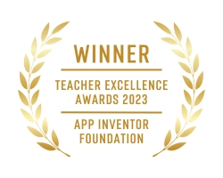
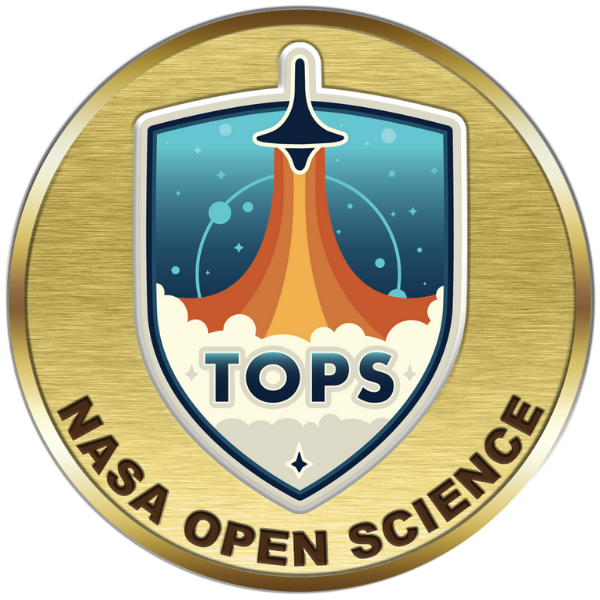
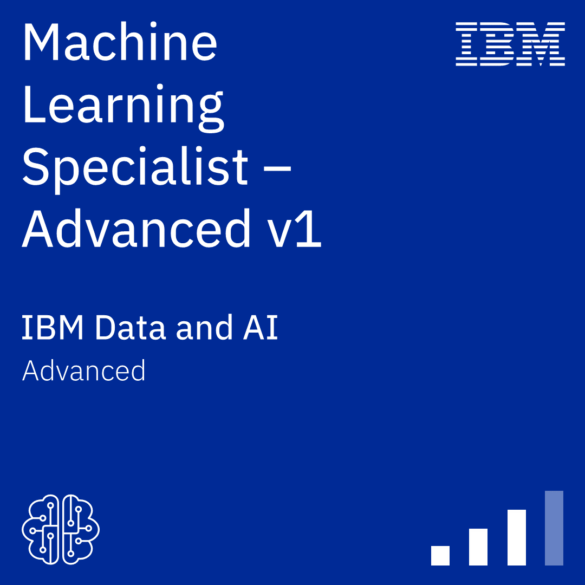

<table align="center" border="1" cellpadding="5" cellspacing="0" style="border-collapse: collapse; border: 1px solid black;">
  <tr>
    <td style="border: 1px solid black; padding: 5px;">
      <p style="text-align: center;">Welcome to my github</p>
      <p style="text-align: center;"><a href="https://rmayormartins.github.io/" target="_blank">Ramon Mayor Martins</a></p>
    </td>
  </tr>
</table>

---
#### About me

Ramon Mayor Martins holds a Ph.D. in Computer Science from the [Universidade Federal de Santa Catarina](https://ufsc.br) (2024). He earned a Master's degree in Telecommunications from the [Instituto Nacional de Telecomunicações](https://www.inatel.br) (2014). He also holds postgraduate certificates in Systems Engineering, Computer Networks, and Telecommunications Systems, along with a Professional MBA in Systems Analysis and Telecommunications. Additionally, he completed a Bachelor's degree in Electrical Engineering with an emphasis on Telematics and Telecommunications Engineering from the [Universidade do Sul de Santa Catarina](https://www.unisul.br) (2010). 

Since 2016, he has been a associate professor in the area of Telecommunications at [Instituto Federal de Santa Catarina](https://www.ifsc.edu.br/), Campus São José.

---
#### Honors and Qualification
<div align="center">
  <table>
    <tr>
      <td align="center"><br><small><i>MIT App Inventor Foundation<br>Teacher Excellence Award</i></small></td>
      <td align="center"><br><small><i>NASA OpenScience<br>Qualified</i></small></td>
      <td align="center"><br><small><i>IBM Machine Learning<br>Specialist - Advanced</i></small></td>
    </tr>
  </table>
</div>

---
#### Interests
```
👨‍🏫🤖|| Strategies for Teaching Machine Learning
📡🛰️|| Radiofrequency and Satellite communications systems projects
💻🤖|| Artificial Intelligence and Machine/Deep Learning projects
👨‍🏫💻|| Computational Thinking and Critical Thinking in Computing Education
```
---
#### Tech profile
```
👨🏻‍💻|| Programmer, since 1998: Basic, Pascal, C, CBuilder, Visual Basic, C++, Shell Script, Matlab, R, Python, Java...
📡|| Ham Radio Operator, since 1996, callsign PU4MAY licensed by ANATEL
🛰️|| Satellite Radio Operator, Callsign PU4MAY licensed by ANATEL
```
---
#### On-the-fly spaces
```
💻🤗|| Hugging Face Spaces: https://huggingface.co/rmayormartins
💻👾|| Replit Code Projects: https://replit.com/@rmayormartins
💻 K|| Kaggle Projects: https://www.kaggle.com/rmayormartins
💻 ℝ|| Shiny R Apps: https://rmayormartins.shinyapps.io/DiagnosticDataset/
```
---
#### Contact me
```
📬🏫||ramon.mayor at: ifsc.edu.br
📬🐧||mayor at: linuxmail.org
```
---
#### Tech Stack🛠💻

<sub></sub>
<sub></sub>
<sub></sub>
<sub></sub>
<sub></sub>
<sub></sub>
<sub></sub>
<sub></sub>
<sub></sub>
<sub></sub>
<sub></sub>
<sub></sub>
<sub></sub>
<sub></sub>
<sub></sub>
<sub></sub>
<sub>[](https://colab.research.google.com/github/Naereen/badges)</sub>
---

#### Revoltz Tech Stack 🏴‍☠️🛠💻
<sub></sub>
<sub></sub>
<sub></sub>
---

#### Stats Stack 📈📊🛠💻

<div align="center">

  
  
  
  
  

  
</div>

<table align="center">
  <tr>
    <td>
      
    </td>
    <td>
      
    </td>
  </tr>
  <tr>
    <td>
      
    </td>
    <td>
      
    </td>
  </tr>
  <tr>
    <td>
      
    </td>
    <td>
      
    </td>
  </tr>
</table>

<model-viewer src="rmayormartins-2025-city.stl"></model-viewer>


<sub></sub><br>
<sub></sub>
---

#### Topic Pursuit🎯💻

<p align="center">
  
  
  
  
  
</p>

---

#### My Memorial (1988-1998)🗿💻
<p align="center">
  
  
  
  
  
  
  

 
  
  
  
  
  
  
  
   
  
  
  
  
  
  
  
</p>

---
#### My statements
<sub>📃💻[In honor of Alan Turing](https://www.cs.virginia.edu/~robins/Turing_Paper_1936.pdf)</sub><br>
<sub>📢💻[In defense of the Goto statement](https://koblents.com/Ches/Links/Month-Mar-2013/20-Using-Goto-in-Linux-Kernel-Code/)</sub><br>

<sub>_...And eternal love with: Computer: XT, MSX; Processor: Zilog Z80; instructions: goto, gosub, gotoxy; libraries: graphics.h, conio.h, Allegro; IDEs: QBasic, Turbo C, devc++ and codeblock_</sub><br>

---
