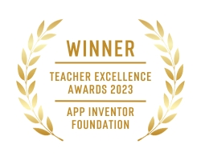
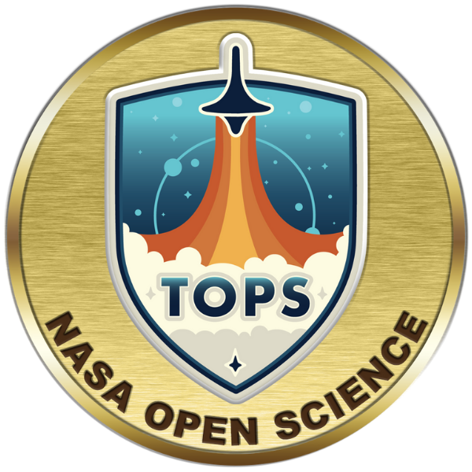
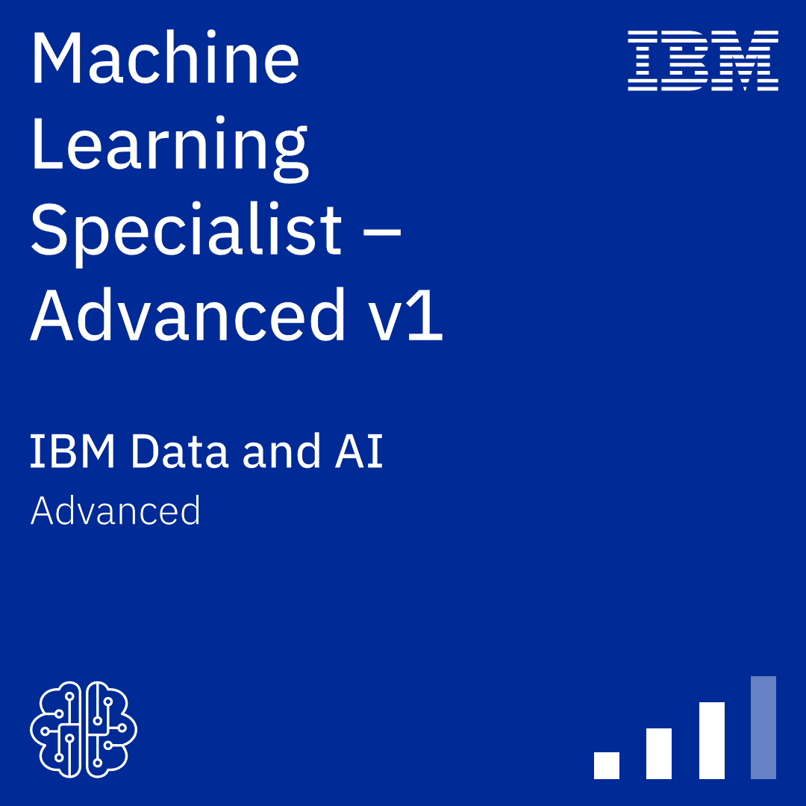
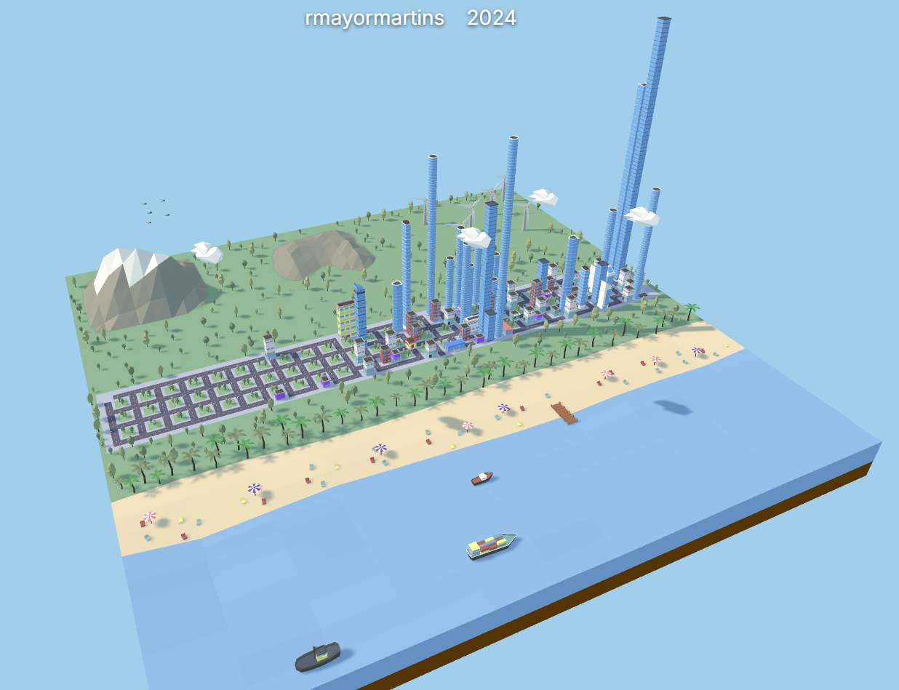

  

#### 

Ramon Mayor Martins holds a Ph.D. in Computer Science from the [Universidade Federal de Santa Catarina](https://ufsc.br) (2024). In 2025 he completed his postdoctoral research in Educational Games at the [Universidade Federal de Santa Catarina](https://ufsc.br). He earned a Master's degree in Telecommunications from the [Instituto Nacional de Telecomunicações](https://www.inatel.br) (2014). Additionally, he also holds postgraduate certificates in Systems Engineering, Computer Networks, and Telecommunications Systems, as well as a Professional MBA in Systems Analysis and Telecommunications. He also completed a Bachelor's degree in Electrical Engineering with an emphasis on Telematics and Telecommunications Engineering from the [Universidade do Sul de Santa Catarina](https://www.unisul.br) (2010). 

Since 2015, he has been a Professor of [**Telecommunications Engineering**](https://www.ifsc.edu.br/en/graduacao/-/visualizar/engenharia-telecomunicacoes/Campus-Sao-Jose/91/141/jqLGNdOIeGbp) at the [Federal Institute of Santa Catarina](https://www.ifsc.edu.br/), (São José Campus).

He is currently the Research and Innovation Coordinator at the IFSC São José Campus.

#### 

  <table>
    <tr>
      <td align="center"> <small><i>MIT App Inventor Foundation Teacher Excellence Award</i></small></td>
      <td align="center"> <small><i>NASA OpenScience Qualified</i></small></td>
      <td align="center"> <small><i>IBM Machine Learning Specialist - Advanced</i></small></td>
      <td align="center"> <small><i>Intel AI Technical   Pro - Advanced</i></small></td>
    </tr>
  </table>

#### 

  

#### 

  
  
  
  
  
  

#### 

  
  
  
  

#### 

<!--START_STATS-->

  

  
  
  
  
  
  

  
  
  
  

<b>📊 Full telemetry</b>

| Metric | Value | Metric | Value |
|:--|:--|:--|:--|
| Public repositories | **81 (82 incl. forks)** | Days on GitHub | **4,051 (since 2015-08-23)** |
| Total stars | **25 (avg 0.31)** | Total forks | **77 (avg 0.95)** |
| Star std deviation | **2.01** | Fork std deviation | **7.39** |
| Repos with 5+ stars | **1** | Repos with 0 stars | **73** |
| Forks > stars | **3 repos** | Avg repo size | **4.9 MB** |
| Largest repo | **starlink-commander (304.4 MB)** | Total size | **394.8 MB** |
| Most common language | **Python** | Unique languages | **10** |
| Top languages | **Python (27), HTML (25), Jupyter Notebook (9)** | GitHub Pages sites | **28** |
| Pushed in last 90 days | **13 (16.0%)** | Avg open issues per repo | **0.01** |
| Most starred | **IFSC-Codespace-ENG-ADS-JAVA-POO (18)** | Most forked | **IFSC-Codespace-ENG-ADS-JAVA-POO (66)** |
| Latest push | **ai-news-radar (today)** | Longest dormant | **TELE-RF-Arduino-nRF24L01 (1,966 d)** |
| First repository | **rmayormartins.github.io (2021-05-07)** | Newest repository | **arducar-lab (2026-09-25)** |
| Repos with open issues | **1 (REPL-PY-pygames-dragster)** | Followers | **57** |
| Contributions (12 mo) | **613** | Commits (12 mo) | **579** |
| Longest streak | **9 days** | Current streak | **4 days** |
| Best day | **28 (2026-09-22)** | Active days (12 mo) | **81** |

**Achievements:** 🏅 50+ Repos · 🏅 20+ Stars · 🏅 50+ Forks · 🏅 25+ Sites · 🏅 10+ Years · 🏅 500+ Contrib/Yr

<b>🌐 Live on GitHub Pages</b> (28 sites)

| | Live site | Source | Language | Last deploy |
|:-:|:--|:--|:--|--:|
| 📡 | [ai-news-radar](https://rmayormartins.github.io/ai-news-radar/) | [code](https://github.com/rmayormartins/ai-news-radar) | HTML | today |
| 📡 | [telecom-news-radar](https://rmayormartins.github.io/telecom-news-radar/) | [code](https://github.com/rmayormartins/telecom-news-radar) | HTML | today |
| 🛰️ | [starlink-commander](https://rmayormartins.github.io/starlink-commander/) | [code](https://github.com/rmayormartins/starlink-commander) | JavaScript | today |
| 🌐 | [arducar-lab](https://rmayormartins.github.io/arducar-lab/) | [code](https://github.com/rmayormartins/arducar-lab) | HTML | 1 d ago |
| 🌐 | [myfll-lab](https://rmayormartins.github.io/myfll-lab/) | [code](https://github.com/rmayormartins/myfll-lab) | HTML | 1 d ago |
| 🏠 | [rmayormartins.github.io](https://rmayormartins.github.io/) | [code](https://github.com/rmayormartins/rmayormartins.github.io) | HTML | 3 d ago |
| 🤖 | [ia-tools](https://rmayormartins.github.io/ia-tools/) | [code](https://github.com/rmayormartins/ia-tools) | HTML | 1 mo ago |
| 🐍 | [ifsc-python](https://rmayormartins.github.io/ifsc-python/) | [code](https://github.com/rmayormartins/ifsc-python) | HTML | 1 mo ago |
| 📡 | [leadradar](https://rmayormartins.github.io/leadradar/) | [code](https://github.com/rmayormartins/leadradar) | HTML | 2 mo ago |
| 🌐 | [rmpagestudio](https://rmayormartins.github.io/rmpagestudio/) | [code](https://github.com/rmayormartins/rmpagestudio) | HTML | 2 mo ago |
| 📶 | [telecom-tools](https://rmayormartins.github.io/telecom-tools/) | [code](https://github.com/rmayormartins/telecom-tools) | HTML | 2 mo ago |
| 🎓 | [IFSC-eng-pfc](https://rmayormartins.github.io/IFSC-eng-pfc/) | [code](https://github.com/rmayormartins/IFSC-eng-pfc) | HTML | 2 mo ago |
| 🛰️ | [sat-commander](https://rmayormartins.github.io/sat-commander/) | [code](https://github.com/rmayormartins/sat-commander) | HTML | 3 mo ago |
| 🌐 | [sistema-pei](https://rmayormartins.github.io/sistema-pei/) | [code](https://github.com/rmayormartins/sistema-pei) | JavaScript | 3 mo ago |
| 🛰️ | [iss-commander](https://rmayormartins.github.io/iss-commander/) | [code](https://github.com/rmayormartins/iss-commander) | HTML | 3 mo ago |
| 🛰️ | [funcube1-commander](https://rmayormartins.github.io/funcube1-commander/) | [code](https://github.com/rmayormartins/funcube1-commander) | HTML | 3 mo ago |
| 🌐 | [aiesthetic](https://rmayormartins.github.io/aiesthetic/) | [code](https://github.com/rmayormartins/aiesthetic) | HTML | 4 mo ago |
| 🎓 | [IFSC-corretor-enem](https://rmayormartins.github.io/IFSC-corretor-enem/) | [code](https://github.com/rmayormartins/IFSC-corretor-enem) | JavaScript | 4 mo ago |
| 🌐 | [trilha-emocional](https://rmayormartins.github.io/trilha-emocional/) | [code](https://github.com/rmayormartins/trilha-emocional) | HTML | 4 mo ago |
| 🌐 | [iptv-cmd](https://rmayormartins.github.io/iptv-cmd/) | [code](https://github.com/rmayormartins/iptv-cmd) | HTML | 5 mo ago |
| 🎓 | [IFSC-eng-pji3](https://rmayormartins.github.io/IFSC-eng-pji3/) | [code](https://github.com/rmayormartins/IFSC-eng-pji3) | HTML | 7 mo ago |
| 🎓 | [IFSC-pesquisa-ensino-2025](https://rmayormartins.github.io/IFSC-pesquisa-ensino-2025/) | [code](https://github.com/rmayormartins/IFSC-pesquisa-ensino-2025) | HTML | 7 mo ago |
| 🌐 | [gym-tracker](https://rmayormartins.github.io/gym-tracker/) | [code](https://github.com/rmayormartins/gym-tracker) | HTML | 9 mo ago |
| 🌐 | [Kamtech-sisdev-barra-do-rio](https://rmayormartins.github.io/Kamtech-sisdev-barra-do-rio/) | [code](https://github.com/rmayormartins/Kamtech-sisdev-barra-do-rio) | HTML | 10 mo ago |
| 🌐 | [kamtech](https://rmayormartins.github.io/kamtech/) | [code](https://github.com/rmayormartins/kamtech) | HTML | 10 mo ago |
| 🌐 | [mapa-risco](https://rmayormartins.github.io/mapa-risco/) | [code](https://github.com/rmayormartins/mapa-risco) | HTML | 11 mo ago |
| 🌐 | [sigap-sc-portos](https://rmayormartins.github.io/sigap-sc-portos/) | [code](https://github.com/rmayormartins/sigap-sc-portos) | JavaScript | 11 mo ago |
| 🌐 | [mapa-alagamentos](https://rmayormartins.github.io/mapa-alagamentos/) | [code](https://github.com/rmayormartins/mapa-alagamentos) | HTML | 1.0 y ago |

<b>🗂️ Repository inventory</b> (81 repos, 🌐 = live site)

| Repository | Language | ⭐ | 🍴 | Created | Last push | Signal |
|:--|:--|--:|--:|:--|--:|:-:|
| [ai-news-radar](https://github.com/rmayormartins/ai-news-radar) [🌐](https://rmayormartins.github.io/ai-news-radar/) | HTML | 0 | 0 | Jun 2026 | today |  |
| [rmayormartins](https://github.com/rmayormartins/rmayormartins) | Python | 0 | 0 | May 2021 | today |  |
| [telecom-news-radar](https://github.com/rmayormartins/telecom-news-radar) [🌐](https://rmayormartins.github.io/telecom-news-radar/) | HTML | 0 | 0 | Jun 2026 | today |  |
| [starlink-commander](https://github.com/rmayormartins/starlink-commander) [🌐](https://rmayormartins.github.io/starlink-commander/) | JavaScript | 0 | 0 | Aug 2025 | today |  |
| [arducar-lab](https://github.com/rmayormartins/arducar-lab) [🌐](https://rmayormartins.github.io/arducar-lab/) | HTML | 0 | 0 | Sep 2026 | 1 d ago |  |
| [myfll-lab](https://github.com/rmayormartins/myfll-lab) [🌐](https://rmayormartins.github.io/myfll-lab/) | HTML | 0 | 0 | Sep 2026 | 1 d ago |  |
| [rmayormartins.github.io](https://github.com/rmayormartins/rmayormartins.github.io) [🌐](https://rmayormartins.github.io/) | HTML | 0 | 0 | May 2021 | 3 d ago |  |
| [ia-tools](https://github.com/rmayormartins/ia-tools) [🌐](https://rmayormartins.github.io/ia-tools/) | HTML | 0 | 0 | May 2025 | 1 mo ago |  |
| [ifsc-python](https://github.com/rmayormartins/ifsc-python) [🌐](https://rmayormartins.github.io/ifsc-python/) | HTML | 0 | 0 | Jul 2026 | 1 mo ago |  |
| [leadradar](https://github.com/rmayormartins/leadradar) [🌐](https://rmayormartins.github.io/leadradar/) | HTML | 0 | 0 | Jul 2026 | 2 mo ago |  |
| [rmpagestudio](https://github.com/rmayormartins/rmpagestudio) [🌐](https://rmayormartins.github.io/rmpagestudio/) | HTML | 0 | 0 | Jul 2026 | 2 mo ago |  |
| [telecom-tools](https://github.com/rmayormartins/telecom-tools) [🌐](https://rmayormartins.github.io/telecom-tools/) | HTML | 0 | 0 | Apr 2026 | 2 mo ago |  |
| [IFSC-eng-pfc](https://github.com/rmayormartins/IFSC-eng-pfc) [🌐](https://rmayormartins.github.io/IFSC-eng-pfc/) | HTML | 0 | 0 | Jun 2026 | 2 mo ago |  |
| [sat-commander](https://github.com/rmayormartins/sat-commander) [🌐](https://rmayormartins.github.io/sat-commander/) | HTML | 0 | 0 | Jun 2026 | 3 mo ago |  |
| [sistema-pei](https://github.com/rmayormartins/sistema-pei) [🌐](https://rmayormartins.github.io/sistema-pei/) | JavaScript | 0 | 0 | May 2026 | 3 mo ago |  |
| [iss-commander](https://github.com/rmayormartins/iss-commander) [🌐](https://rmayormartins.github.io/iss-commander/) | HTML | 1 | 0 | Apr 2026 | 3 mo ago |  |
| [funcube1-commander](https://github.com/rmayormartins/funcube1-commander) [🌐](https://rmayormartins.github.io/funcube1-commander/) | HTML | 0 | 0 | May 2026 | 3 mo ago |  |
| [IFSC-TCC-TYPST](https://github.com/rmayormartins/IFSC-TCC-TYPST) | Typst | 0 | 0 | Jun 2025 | 3 mo ago |  |
| [aiesthetic](https://github.com/rmayormartins/aiesthetic) [🌐](https://rmayormartins.github.io/aiesthetic/) | HTML | 0 | 0 | May 2026 | 4 mo ago |  |
| [IFSC-corretor-enem](https://github.com/rmayormartins/IFSC-corretor-enem) [🌐](https://rmayormartins.github.io/IFSC-corretor-enem/) | JavaScript | 0 | 0 | Apr 2026 | 4 mo ago |  |
| [trilha-emocional](https://github.com/rmayormartins/trilha-emocional) [🌐](https://rmayormartins.github.io/trilha-emocional/) | HTML | 0 | 0 | May 2026 | 4 mo ago |  |
| [iptv-cmd](https://github.com/rmayormartins/iptv-cmd) [🌐](https://rmayormartins.github.io/iptv-cmd/) | HTML | 1 | 0 | Apr 2026 | 5 mo ago |  |
| [IFSC-eng-pji3](https://github.com/rmayormartins/IFSC-eng-pji3) [🌐](https://rmayormartins.github.io/IFSC-eng-pji3/) | HTML | 0 | 0 | Feb 2026 | 7 mo ago |  |
| [IFSC-pesquisa-ensino-2025](https://github.com/rmayormartins/IFSC-pesquisa-ensino-2025) [🌐](https://rmayormartins.github.io/IFSC-pesquisa-ensino-2025/) | HTML | 0 | 0 | Feb 2026 | 7 mo ago |  |
| [gym-tracker](https://github.com/rmayormartins/gym-tracker) [🌐](https://rmayormartins.github.io/gym-tracker/) | HTML | 0 | 0 | Dec 2025 | 9 mo ago |  |
| [Kamtech-sisdev-barra-do-rio](https://github.com/rmayormartins/Kamtech-sisdev-barra-do-rio) [🌐](https://rmayormartins.github.io/Kamtech-sisdev-barra-do-rio/) | HTML | 0 | 0 | Oct 2025 | 10 mo ago |  |
| [kamtech](https://github.com/rmayormartins/kamtech) [🌐](https://rmayormartins.github.io/kamtech/) | HTML | 0 | 0 | Oct 2025 | 10 mo ago |  |
| [mapa-risco](https://github.com/rmayormartins/mapa-risco) [🌐](https://rmayormartins.github.io/mapa-risco/) | HTML | 0 | 0 | Oct 2025 | 11 mo ago |  |
| [sigap-sc-portos](https://github.com/rmayormartins/sigap-sc-portos) [🌐](https://rmayormartins.github.io/sigap-sc-portos/) | JavaScript | 0 | 0 | Oct 2025 | 11 mo ago |  |
| [mapa-alagamentos](https://github.com/rmayormartins/mapa-alagamentos) [🌐](https://rmayormartins.github.io/mapa-alagamentos/) | HTML | 0 | 0 | Sep 2025 | 1.0 y ago |  |
| [VERCEL-ai-news-hub](https://github.com/rmayormartins/VERCEL-ai-news-hub) | JavaScript | 0 | 0 | Jun 2025 | 1.3 y ago |  |
| [VERCEL-red-alert-map](https://github.com/rmayormartins/VERCEL-red-alert-map) | HTML | 0 | 0 | Jun 2025 | 1.3 y ago |  |
| [IFSC-Codespace-ENG-ADS-JAVA-POO-BACKUP](https://github.com/rmayormartins/IFSC-Codespace-ENG-ADS-JAVA-POO-BACKUP) | - | 0 | 1 | Jun 2025 | 1.3 y ago |  |
| [IFSC-Codespace-ENG-ADS-JAVA-POO](https://github.com/rmayormartins/IFSC-Codespace-ENG-ADS-JAVA-POO) | - | 18 | 66 | Sep 2024 | 1.3 y ago |  |
| [SPACE-PY-java-air-combat](https://github.com/rmayormartins/SPACE-PY-java-air-combat) | Jupyter Notebook | 0 | 0 | May 2025 | 1.3 y ago |  |
| [IFSC-Codespace-ENG-C-PRG1](https://github.com/rmayormartins/IFSC-Codespace-ENG-C-PRG1) | C | 0 | 9 | Aug 2024 | 1.6 y ago |  |
| [SPACE-PY-c-cpp-inspector](https://github.com/rmayormartins/SPACE-PY-c-cpp-inspector) | Python | 0 | 0 | Jan 2025 | 1.7 y ago |  |
| [SPACE-AI-PY-ai-multiagents-committee](https://github.com/rmayormartins/SPACE-AI-PY-ai-multiagents-committee) | Python | 0 | 0 | Jan 2025 | 1.7 y ago |  |
| [SPACE-AI-PY-gtm-keras-h5-predictor](https://github.com/rmayormartins/SPACE-AI-PY-gtm-keras-h5-predictor) | Python | 0 | 0 | Dec 2024 | 1.8 y ago |  |
| [SPACE-PY-gtm-scope](https://github.com/rmayormartins/SPACE-PY-gtm-scope) | Python | 0 | 0 | Dec 2024 | 1.8 y ago |  |
| [SPACE-AI-PY-image-classifier-interactive](https://github.com/rmayormartins/SPACE-AI-PY-image-classifier-interactive) | Python | 0 | 0 | Dec 2024 | 1.8 y ago |  |
| [SPACE-AI-PY-image-classifier](https://github.com/rmayormartins/SPACE-AI-PY-image-classifier) | Python | 0 | 0 | Dec 2024 | 1.8 y ago |  |
| [SPACE-PY-image-conversor-dpi](https://github.com/rmayormartins/SPACE-PY-image-conversor-dpi) | Python | 0 | 0 | Dec 2024 | 1.8 y ago |  |
| [SPACE-AI-PY-image-enhancer](https://github.com/rmayormartins/SPACE-AI-PY-image-enhancer) | Python | 0 | 0 | Dec 2024 | 1.8 y ago |  |
| [SPACE-PY-image-inspector](https://github.com/rmayormartins/SPACE-PY-image-inspector) | Python | 0 | 0 | Dec 2024 | 1.8 y ago |  |
| [SPACE-PY-image-license-inspector](https://github.com/rmayormartins/SPACE-PY-image-license-inspector) | Python | 0 | 0 | Dec 2024 | 1.8 y ago |  |
| [SPACE-AI-PY-ai-q-learning-vacuum-robot](https://github.com/rmayormartins/SPACE-AI-PY-ai-q-learning-vacuum-robot) | Python | 0 | 0 | Dec 2024 | 1.8 y ago |  |
| [SPACE-PY-java-inspector-judge](https://github.com/rmayormartins/SPACE-PY-java-inspector-judge) | Python | 0 | 0 | Dec 2024 | 1.8 y ago |  |
| [SPACE-PY-aia-scope](https://github.com/rmayormartins/SPACE-PY-aia-scope) | Python | 0 | 0 | Dec 2024 | 1.8 y ago |  |
| [SPACE-AI-PY-neural-style-transfer-deepdreaming](https://github.com/rmayormartins/SPACE-AI-PY-neural-style-transfer-deepdreaming) | Python | 0 | 0 | Dec 2024 | 1.8 y ago |  |
| [SPACE-AI-PY-neural-style-transfer](https://github.com/rmayormartins/SPACE-AI-PY-neural-style-transfer) | Jupyter Notebook | 0 | 0 | Nov 2023 | 1.8 y ago |  |
| [SPACE-AI-PY-nlp-rag-langchain](https://github.com/rmayormartins/SPACE-AI-PY-nlp-rag-langchain) | Python | 0 | 0 | Dec 2024 | 1.8 y ago |  |
| [SPACE-AI-PY-ocr-img2txt](https://github.com/rmayormartins/SPACE-AI-PY-ocr-img2txt) | Python | 0 | 0 | Dec 2024 | 1.8 y ago |  |
| [SPACE-PY-onnx-scope](https://github.com/rmayormartins/SPACE-PY-onnx-scope) | Python | 0 | 0 | Dec 2024 | 1.8 y ago |  |
| [SPACE-PY-pth-scope](https://github.com/rmayormartins/SPACE-PY-pth-scope) | Python | 0 | 0 | Dec 2024 | 1.8 y ago |  |
| [SPACE-AI-PY-sentiment-analysis-committee](https://github.com/rmayormartins/SPACE-AI-PY-sentiment-analysis-committee) | Python | 0 | 0 | Dec 2024 | 1.8 y ago |  |
| [SPACE-AI-PY-speech-accent-ES-PT-classifier](https://github.com/rmayormartins/SPACE-AI-PY-speech-accent-ES-PT-classifier) | Python | 1 | 0 | Dec 2024 | 1.8 y ago |  |
| [SPACE-PY-speech-scope](https://github.com/rmayormartins/SPACE-PY-speech-scope) | Python | 0 | 0 | Dec 2024 | 1.8 y ago |  |
| [SPACE-AI-PY-svgbuilder-llama3](https://github.com/rmayormartins/SPACE-AI-PY-svgbuilder-llama3) | Python | 0 | 0 | Dec 2024 | 1.8 y ago |  |
| [SPACE-AI-PY-yolov5-farm-cattle](https://github.com/rmayormartins/SPACE-AI-PY-yolov5-farm-cattle) | Python | 1 | 1 | Dec 2024 | 1.8 y ago |  |
| [SPACE-AI-PY-yolov5-sunspot-hunter](https://github.com/rmayormartins/SPACE-AI-PY-yolov5-sunspot-hunter) | Python | 1 | 0 | Dec 2024 | 1.8 y ago |  |
| [SHINY-R-DiagnosticDataset](https://github.com/rmayormartins/SHINY-R-DiagnosticDataset) | R | 0 | 0 | Oct 2024 | 1.8 y ago |  |
| [TELE-RF-Antenna-NEC2C-Diagram-Imp](https://github.com/rmayormartins/TELE-RF-Antenna-NEC2C-Diagram-Imp) | Jupyter Notebook | 0 | 0 | Aug 2024 | 2.1 y ago |  |
| [REPL-PY-pygames-dragster](https://github.com/rmayormartins/REPL-PY-pygames-dragster) | Python | 0 | 0 | Jul 2024 | 2.2 y ago |  |
| [SPACE-AI-PY-Q-learning-vacuum-robot-v1](https://github.com/rmayormartins/SPACE-AI-PY-Q-learning-vacuum-robot-v1) | Jupyter Notebook | 0 | 0 | Jul 2024 | 2.2 y ago |  |
| [AI-ML-R-ANN-RandomForest-SpeakerRecognition](https://github.com/rmayormartins/AI-ML-R-ANN-RandomForest-SpeakerRecognition) | R | 1 | 0 | May 2021 | 2.3 y ago |  |
| [AI-DL-PY-Fastai-classificadorcompleto_visual](https://github.com/rmayormartins/AI-DL-PY-Fastai-classificadorcompleto_visual) | Jupyter Notebook | 0 | 0 | Apr 2024 | 2.5 y ago |  |
| [DOC-tese-analises-backup](https://github.com/rmayormartins/DOC-tese-analises-backup) | - | 0 | 0 | Apr 2024 | 2.5 y ago |  |
| [AI-ML-PY-ManyTechniques-General](https://github.com/rmayormartins/AI-ML-PY-ManyTechniques-General) | Jupyter Notebook | 0 | 0 | Jun 2022 | 4.3 y ago |  |
| [AI-DL-PY-fastai-cnn-treeclassificator](https://github.com/rmayormartins/AI-DL-PY-fastai-cnn-treeclassificator) | Jupyter Notebook | 1 | 0 | May 2021 | 4.3 y ago |  |
| [AI-ML-PY-HOG-SVM-foilclassificator](https://github.com/rmayormartins/AI-ML-PY-HOG-SVM-foilclassificator) | Jupyter Notebook | 0 | 0 | Feb 2022 | 4.6 y ago |  |
| [TELE-RF-PY-GNURadio-Tx-Rx-Modulators-Demodulators](https://github.com/rmayormartins/TELE-RF-PY-GNURadio-Tx-Rx-Modulators-Demodulators) | Python | 0 | 0 | May 2021 | 5.4 y ago |  |
| [AI-ML-ShellScript-HTK-SpeechRecognition](https://github.com/rmayormartins/AI-ML-ShellScript-HTK-SpeechRecognition) | Shell | 0 | 0 | May 2021 | 5.4 y ago |  |
| [AI-ML-Python-ManyTechniques-AccentSpeechRecognition](https://github.com/rmayormartins/AI-ML-Python-ManyTechniques-AccentSpeechRecognition) | Jupyter Notebook | 0 | 0 | May 2021 | 5.4 y ago |  |
| [AI-ML-R-RandomForest-WyneRobot](https://github.com/rmayormartins/AI-ML-R-RandomForest-WyneRobot) | R | 0 | 0 | May 2021 | 5.4 y ago |  |
| [TELE-RF-Arduino-Wifi-ESP8266](https://github.com/rmayormartins/TELE-RF-Arduino-Wifi-ESP8266) | C++ | 0 | 0 | May 2021 | 5.4 y ago |  |
| [Probability-MATLAB-Distributions](https://github.com/rmayormartins/Probability-MATLAB-Distributions) | MATLAB | 0 | 0 | May 2021 | 5.4 y ago |  |
| [AI-ML-R-ManyTechniques-VehicleSilhouette](https://github.com/rmayormartins/AI-ML-R-ManyTechniques-VehicleSilhouette) | R | 0 | 0 | May 2021 | 5.4 y ago |  |
| [AI-ML-C-Fann-ANN](https://github.com/rmayormartins/AI-ML-C-Fann-ANN) | C | 0 | 0 | May 2021 | 5.4 y ago |  |
| [TELE-RF-Arduino-RFID-MFRC522](https://github.com/rmayormartins/TELE-RF-Arduino-RFID-MFRC522) | C++ | 0 | 0 | May 2021 | 5.4 y ago |  |
| [TELE-RF-Arduino-nRF24L01](https://github.com/rmayormartins/TELE-RF-Arduino-nRF24L01) | C++ | 0 | 0 | May 2021 | 5.4 y ago |  |

🤖 Auto-updated daily by <a href="generate_stats.py">generate_stats.py</a> (GitHub Actions) · last sync 2026-09-26 10:37 UTC

<!--END_STATS-->

#### 

  

#### 

<b>Third party cards</b> (served by other people's services, so they can go down)

<table align="center">
  <tr>
    <td>
      
    </td>
    <td>
      
    </td>
  </tr>
</table>

  
  

<table align="center">
  <tr>
    <td>
      
    </td>
    <td>
      
    </td>
  </tr>
  <tr>
    <td>
      
    </td>
    <td>
      
    </td>
  </tr>
</table>

#### 

  
  

#### 

<table align="center">
  <tr>
    <td></td>
    <td></td>
    <td></td>
    <td></td>
    <td></td>
    <td></td>
  </tr>
</table>

#### 

<!--
  My Memorial : versao corrigida.
  Cada imagem passa por https://images.weserv.nl/ que faz crop+resize no servidor,
  garantindo 140x80 uniformes mesmo que o GitHub Markdown ignore width/height.
  Parametros: w=140, h=80, fit=cover (crop centralizado), a=attention (foco no centro de interesse).
-->

<table align="center">
  <tr>
    <td></td>
    <td></td>
    <td></td>
    <td></td>
    <td></td>
    <td></td>
  </tr>
  <tr>
    <td></td>
    <td></td>
    <td></td>
    <td></td>
    <td></td>
    <td></td>
  </tr>
  <tr>
    <td></td>
    <td></td>
    <td></td>
    <td></td>
    <td></td>
    <td></td>
  </tr>
  <tr>
    <td></td>
    <td></td>
    <td></td>
    <td></td>
    <td></td>
    <td></td>
  </tr>
  <tr>
    <td></td>
    <td></td>
    <td></td>
    <td></td>
    <td></td>
    <td></td>
  </tr>
</table>

#### 

📃💻[In honor of Alan Turing](https://www.cs.virginia.edu/~robins/Turing_Paper_1936.pdf) 
📢💻[In defense of the Goto statement](https://koblents.com/Ches/Links/Month-Mar-2013/20-Using-Goto-in-Linux-Kernel-Code/) 

_...And eternal love with: Computer: XT, MSX; Processor: Zilog Z80; instructions: goto, gosub, gotoxy; libraries: graphics.h, conio.h, Allegro; IDEs: QBasic, Turbo C, devc++ and codeblock_ 

  

ramon.mayor at ifsc.edu.br  ·  rmayormartins at gmail.com  ·  callsign PU4MAY

